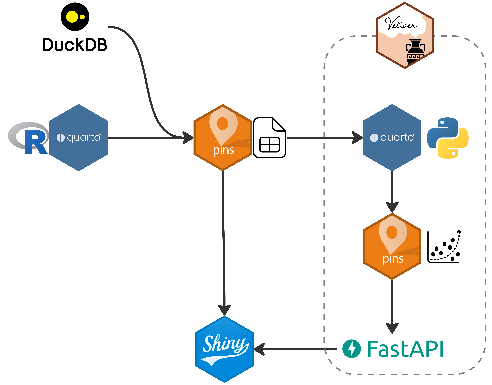

# Gapminder Analysis

This repository contains an example data science workflow using the [gapminder dataset](https://www.gapminder.org/).

## Folder Structure

-   `/data` - Analyis for extracting and pinning data to Posit Connect.

-   `/understand` - A FastAPI that serves a random forests model (see `/prod/understand/gapminder_model.qmd`.

-   `/prod` - Production content that is hosted to Posit Connect using git-backed publishing. Contains the shiny application that will be used to demo git-backed deployment.

-   `/images` - images for README and other content.
